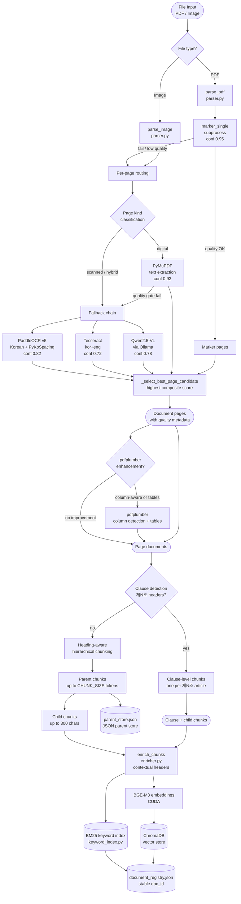
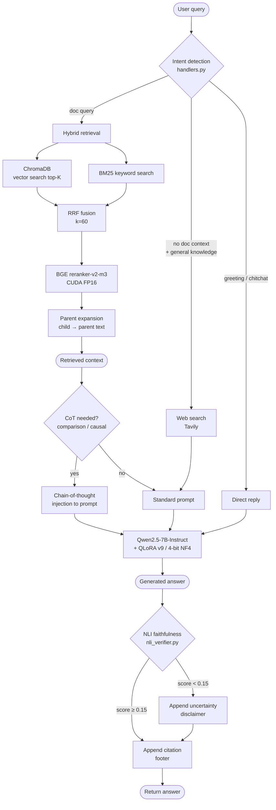

# Tilon AI Chatbot Architecture

## Overview

Tilon AI Chatbot is a document-first RAG backend for Korean/English PDFs and images with an attached QLoRA fine-tuning workflow for the answer model.

The repository should be understood as two connected systems:

1. document RAG inference
2. answer-model fine-tuning and evaluation

Both are active and deployed. The system is general-purpose — it works with any uploaded document, with no hardcoded behavior for specific document types.

Current roadmap status:
- `Phase 10A` chat-flow refactor: complete
- `Phase 10B` routing/classifier layer: complete
- `Phase 10C` structure-aware retrieval: validated on targeted retrieval evals
- `Phase 10D` verifier / grounding upgrades: validated on current grounding regression suites
- `Phase 11` v10 experiment cycle (2026-03-30): SFT on 7B flat, 14B flat, token expansion flat, VLM hybrid ineffective — all exhausted
- `Phase 12` pipeline fixes (2026-03-30): pipe-table extractor, overlap bypass tightening, presence handler compound matching, full-doc chain pipe extractor — **pipeline track now frozen**

Current reading:
- **pipeline track: frozen** — deterministic pipe-table extractor + 3 reliability fixes deployed, external 3/10, tables 2/8
- **training track: active** — this is now the primary improvement path
- retrieval is strong (source_recall=1.0 across all 18 eval failures)
- 14B model produces byte-identical outputs to 7B — model capacity is not the bottleneck
- remaining 13 failures are all model generation quality: Chinese drift, hallucination, incomplete extraction, narrative table reading

Current architectural next step (training track):
1. ~~align train/serve prompt templates~~ — **DONE (2026-03-30)**
2. mine 13 confirmed model-side failures into labeled v11 training rows **(active)**
3. SSFO (Self-Supervised Faithfulness Optimization) preference pairs (400-500)
4. RAFT-format training with oracle + distractor documents
5. general instruction mix + two-stage SFT+SimPO

Current model recommendation:
- stay on Qwen2.5-7B-Instruct + QLoRA v9 as production baseline
- next SFT round should use SSFO preference pairs and RAFT format, not just more SFT on the same template
- do NOT change model family, model size, or token limits — all confirmed as non-bottlenecks

## Product Scopes

The system works with two document scopes:

- `data/library/`
  Persistent team documents that form the long-term knowledge base

- `data/uploads/`
  Chat-uploaded files that are ingested for the current chat flow and kept separate from the permanent library corpus

---

## Ingestion Flow



---

## Query / Chat Flow



## High-Level Flow

### Library documents
1. Files are added to `data/library/`
2. Startup ingest or watcher detects them
3. Parser extracts text from PDF/image pages (layered 5-method pipeline with per-page routing)
4. pdfplumber enhancement: column-aware extraction replaces PyMuPDF when 2-column layout is detected; tables extracted as separate documents
5. Clause detection: documents with Korean legal articles (`제N조`) are split into one chunk per article
6. Remaining content goes through hierarchical parent-child chunking
7. Contextual enrichment adds document/page/section headers
8. Child chunks are embedded (BGE-M3) and stored in ChromaDB + BM25 index
9. Parent texts saved to `data/parent_store.json`
10. Chat can retrieve them globally

### Chat uploads
1. User uploads via `/ui`, `/upload`, `/upload-multiple`, or `/chat-with-file`
2. File is saved to `data/uploads/`
3. Parsed → pdfplumber enhanced → clause/hierarchical chunked → enriched → embedded → registered
4. UI sidebar remembers uploaded files via `document_registry`
5. If exactly one uploaded file is active, deictic prompts like `이 문서` / `this document` auto-scope to that file
6. Chat can re-scope to one or many remembered uploads
7. Whole-document tasks load full upload scope rather than top-k chunks only

## Bigger-Picture Architecture

The full product path is:

1. document input
2. extraction / parsing (5-method layered pipeline, per-page)
3. pdfplumber column-aware enhancement + table extraction
4. clause-level splitting for Korean legal articles (`제N조`), or hierarchical parent-child chunking for other content
5. contextual enrichment
6. BGE-M3 embeddings (child/clause chunks)
7. ChromaDB vector store + BM25 keyword index
8. hybrid retrieval (vector + keyword + RRF fusion)
9. BGE reranker-v2-m3
10. parent expansion (child match → parent context)
11. context-relevance gate (reranker scores question vs top chunks; < 0.25 → not_found)
12. prompt construction (with optional CoT injection)
13. answer generation (Qwen2.5-7B + QLoRA v9)
14. tiered NLI faithfulness gate (< 0.15 → replace; 0.15–0.35 → disclaimer; ≥ 0.35 → pass)
15. compact citation footer (maps [1], [2] markers → source file + page, capped to the evidence actually used)

Additional current reliability behavior:
- document-backed grounding now runs for unscoped corpus answers as well as explicitly scoped answers
- single-upload narrative summary questions can bypass giant full-context prompts via a deterministic single-document summary builder
- explicit document names inside library questions can auto-scope to that library PDF
- retrieval dominated by one library document family can promote an unscoped query into an implicit single-document exact-answer path
- supported two-document comparisons can use a deterministic comparison builder instead of the generic LLM path
- `제N조` lookups on non-clause documents return a clean format-mismatch explanation instead of hallucinated article text
- broad year/number questions can use deterministic numeric extraction before free-form generation
- strict-fact table/value queries can promote to one exact source/doc and then answer from the full exact document rather than mixed-family chunks when the scorer is confident enough
- pipe-delimited table content (from pdfplumber) can be answered via deterministic row/field extraction — runs in both scoped and full-document handler chains
- presence-style questions (e.g., "이 문서에 X가 있나요?") require all query terms to appear together in at least one chunk before answering affirmatively
- overlap bypass for weak-relevance matches requires adjacent token pairs, not just scattered individual tokens

Key distinction:
- RAG retrieves the evidence
- QLoRA improves how the model uses that evidence
- NLI verifies the answer matches the evidence

QLoRA is not a substitute for bad extraction, weak chunking, or poor retrieval.

Current architectural interpretation:
- most recent benchmark gains came from retrieval, scoping, deterministic exact-answer, and not-found/comparison fixes
- the current deployed adapter did not change during that improvement
- therefore the system is still more pipeline-limited than model-limited on the active PDF-grounding benchmark

## Storage Layout

```text
data/
├── library/
├── uploads/
└── temp/
```

This separation keeps permanent corpus behavior and chat-upload behavior independent.

## Core Components

### API layer
- [main.py](/home/tilon/chatbot-karbi/main.py)
- [app/api/routes.py](/home/tilon/chatbot-karbi/app/api/routes.py)
- [app/api/upload_ui.py](/home/tilon/chatbot-karbi/app/api/upload_ui.py)
- [app/api/openai_compat.py](/home/tilon/chatbot-karbi/app/api/openai_compat.py)

Responsibilities:
- endpoints
- built-in UI
- upload handling
- OpenAI-compatible interface

### Parsing / ingestion layer
- [app/pipeline/parser.py](/home/tilon/chatbot-karbi/app/pipeline/parser.py)
- [app/pipeline/chunker.py](/home/tilon/chatbot-karbi/app/pipeline/chunker.py)
- [app/pipeline/enricher.py](/home/tilon/chatbot-karbi/app/pipeline/enricher.py)
- [app/pipeline/ingest.py](/home/tilon/chatbot-karbi/app/pipeline/ingest.py)
- [app/core/paddle_ocr.py](/home/tilon/chatbot-karbi/app/core/paddle_ocr.py)
- [app/core/parent_store.py](/home/tilon/chatbot-karbi/app/core/parent_store.py)

Responsibilities:
- PDF/image extraction (5-method per-page pipeline)
- PaddleOCR v5 Korean OCR with PyKoSpacing post-processing as the preferred scanned/hybrid OCR path
- pdfplumber column-aware extraction and table detection
- clause-level splitting for Korean legal articles (`제N조`)
- hierarchical parent-child chunking
- contextual enrichment
- parent text storage
- ingestion orchestration

### Retrieval layer
- [app/core/vectorstore.py](/home/tilon/chatbot-karbi/app/core/vectorstore.py)
- [app/retrieval/retriever.py](/home/tilon/chatbot-karbi/app/retrieval/retriever.py)
- [app/retrieval/keyword_index.py](/home/tilon/chatbot-karbi/app/retrieval/keyword_index.py)
- [app/retrieval/reranker.py](/home/tilon/chatbot-karbi/app/retrieval/reranker.py)

Responsibilities:
- vector search
- keyword search
- reciprocal rank fusion
- reranking
- scoped retrieval
- whole-document loading

### Chat layer
- [app/chat/handlers.py](/home/tilon/chatbot-karbi/app/chat/handlers.py)
- [app/chat/prompts.py](/home/tilon/chatbot-karbi/app/chat/prompts.py)
- [app/chat/policy.py](/home/tilon/chatbot-karbi/app/chat/policy.py)
- [app/chat/scope.py](/home/tilon/chatbot-karbi/app/chat/scope.py)
- [app/chat/retrieval_flow.py](/home/tilon/chatbot-karbi/app/chat/retrieval_flow.py)
- [app/chat/query_classifier.py](/home/tilon/chatbot-karbi/app/chat/query_classifier.py)
- [app/chat/query_classifier_data.py](/home/tilon/chatbot-karbi/app/chat/query_classifier_data.py)
- [app/core/nli_verifier.py](/home/tilon/chatbot-karbi/app/core/nli_verifier.py)

Responsibilities:
- stage-based chat orchestration
- centralized query routing policy
- optional embedding-backed routing classifier
- prompt building with optional chain-of-thought injection
- answer-type handling (lookup, summary, comparison, clarify)
- deterministic exact-answer shortcuts for clause/table/value-heavy document questions
- deterministic pipe-table extractor for pipe-delimited `col1 | col2 | col3` content (3-gate: signal word → pipe table → row score ≥3.0, with formula-column full-row expansion)
- deterministic two-document comparison answers for supported comparison dimensions
- presence handler with compound concept matching (all query terms must co-occur in one chunk)
- single-upload auto-scope resolution
- library document-name auto-scope and dominant-document implicit scope promotion
- deterministic single-document summary for narrative uploads
- non-clause article-query fallback
- deterministic numeric fact extraction for year/number-style prompts
- low-confidence and not-found fallback behavior with adjacent-token pair overlap check
- broadened web search fallback for general knowledge queries
- upload-scope behavior
- deterministic file-by-file multi-document summary
- structure-aware retrieval expansion
- NLI faithfulness verification post-generation

### Fine-tuning layer
- [finetuning/train.py](/home/tilon/chatbot-karbi/finetuning/train.py)
- [finetuning/evaluate_adapter.py](/home/tilon/chatbot-karbi/finetuning/evaluate_adapter.py)
- [finetuning/infer_compare.py](/home/tilon/chatbot-karbi/finetuning/infer_compare.py)

Responsibilities:
- Qwen chat-template-consistent training
- local adapter evaluation
- base vs adapter comparison
- strict Korean-heavy regression testing

## Extraction Strategy

The parser uses a 5-method layered pipeline with per-page quality-gated routing, followed by an optional pdfplumber enhancement pass.

### File-level (tried first)

| Method | Confidence | Used when |
|--------|-----------|----------|
| `marker_single` subprocess | 0.95 | All PDFs — best for digital/text-heavy |

If marker fails or produces low-quality output, the parser falls back to per-page routing.

### Per-page routing

Each page is classified as `digital`, `hybrid`, or `scanned` based on text yield and pixel analysis.

| Method | Confidence | Activates when |
|--------|-----------|----------------|
| PyMuPDF text extraction | 0.92 | Page is `digital` |
| PaddleOCR v5 Korean + PyKoSpacing | 0.82 | Page is `scanned` or `hybrid` (PADDLE_OCR_ENABLED=true) |
| Qwen2.5-VL via Ollama | 0.78 | OCR still insufficient (VLM_EXTRACTION_ENABLED=true) |
| Tesseract kor+eng | 0.72 | Always tried as baseline OCR fallback |

All candidates are scored by `_select_best_page_candidate()` and the highest-scoring one wins.

### pdfplumber enhancement pass

After the primary extraction, `_apply_pdfplumber_enhancements()` runs on all PDF pages:

1. **Column-aware extraction:** detects 2-column layouts by analyzing word x-coordinate distribution around the page midpoint. When detected, extracts left column then right column for correct reading order.
2. **Table extraction:** pdfplumber tables are extracted as separate `chunk_type="table"` documents with pipe-delimited row format.
3. **Page replacement:** a PyMuPDF page is replaced with the pdfplumber version when: column-aware extraction produced a cleaner result, the original is garbled, or pdfplumber yields ≥25% more characters.

This solves the common problem of interleaved text from 2-column Korean PDFs (e.g., `제1조` and `제9조` mixed together in a single text stream).

PaddleOCR notes:
- Uses PPOCRv5 Korean mobile model (CPU mode during ingest)
- PyKoSpacing corrects Korean word-spacing errors post-OCR
- Set `PADDLE_PDX_DISABLE_MODEL_SOURCE_CHECK=True` in env to avoid connectivity check
- Lazy-loaded on first scanned/hybrid page — does not affect startup if no scanned PDFs

Parser improvements delivered:
- per-page routing instead of file-level routing
- page type classification: `digital`, `hybrid`, `scanned`
- quality gates for low-yield and garbled text
- PaddleOCR v5 with PyKoSpacing (replaces Tesseract as preferred Korean OCR)
- pdfplumber column-aware extraction for 2-column PDFs
- pdfplumber table extraction as separate document artifacts
- richer metadata: `extraction_method`, `page_kind`, `routing_reason`, `extractors_used`, `confidence`

## Retrieval Strategy

### Hybrid retrieval pipeline

| Step | Component | Notes |
|------|-----------|-------|
| 1 | ChromaDB vector search | BGE-M3 embeddings, top-K by cosine |
| 2 | BM25 keyword search | `keyword_index.py`, Korean tokenization |
| 3 | RRF fusion | k=60, merges both ranked lists |
| 4 | BGE reranker-v2-m3 | CUDA FP16, cross-encoder rescoring |
| 5 | Parent + structural expansion | Matched children → parent chunk text or query-matched structural section |
| 6 | Confidence gating | Threshold filters weak results, except strong lexical-overlap scoped matches |

### Chunking strategy

Documents are chunked using a priority system:

1. **Clause-level splitting** (highest priority): documents containing Korean legal article headers (`제N조(title)`) are split into one atomic chunk per article. Each clause becomes a `chunk_type="clause"` chunk. This keeps regulatory content intact and prevents cross-article fragmentation.
2. **Hierarchical parent-child chunking** (default): remaining content is split into parent sections (≤ CHUNK_SIZE tokens, heading-aware), then each parent is further split into child chunks (≤300 chars) for high-precision vector search.
3. **Table chunks**: pdfplumber-extracted tables become separate `chunk_type="table"` documents.

### Parent expansion
Documents are indexed as small child chunks (≤300 chars) or atomic clause chunks for high-precision retrieval.
After reranking, each matched child is replaced with its parent text (the full section it came from).
This gives the LLM broader context without polluting the vector index with long chunks.

### Structure-aware expansion
When the query explicitly or implicitly names a structural target such as `제N조`, `제N장`, `article N`, `section N`, or a distinctive section-heading phrase, retrieval expands around the matched section instead of leaving the model with an isolated fragment. This is especially important for:

- article lookup
- article-to-article comparison
- chapter/section lookup
- scoped structure-summary questions

### Scoped document behavior
- specific question → top-k scoped retrieval
- summary/analysis → full scoped document loading
- OCR request → direct extraction result
- bundled upload ambiguity → clarification or named-scope narrowing
- multi-file summary → deterministic file-level grouping
- exactly one uploaded document → auto-scope `이 문서` / `this document` style questions to that file

### Chat-level reliability
- Context-relevance pre-check (reranker scores question vs top chunks; < 0.25 → not_found before LLM)
- General knowledge queries with no doc context → Tavily web search fallback
- Comparison/causal/procedural queries → chain-of-thought prompt injection
- Post-generation → tiered NLI faithfulness gate (< 0.15 → replace; 0.15–0.35 → disclaimer; ≥ 0.35 → pass)
- Document-backed grounding now covers both scoped and unscoped document answers
- Citation footer maps inline `[1]`, `[2]` markers to source file + page in a compact capped footer
- inline citation fallback and citation-aware faithfulness scoring are active

## Evaluation Assets

Benchmark and evaluation assets now include:

- library benchmark:
  - [benchmark_tilon_v1.jsonl](/home/tilon/chatbot-karbi/finetuning/data/benchmark_tilon_v1.jsonl)
- upload-scoped benchmark:
  - [benchmark_upload_scoped_v1.jsonl](/home/tilon/chatbot-karbi/finetuning/data/benchmark_upload_scoped_v1.jsonl)
- comparison benchmark:
  - [benchmark_compare_v1.jsonl](/home/tilon/chatbot-karbi/finetuning/data/benchmark_compare_v1.jsonl)
- routing eval sets:
  - [query_policy_eval_v1.jsonl](/home/tilon/chatbot-karbi/finetuning/data/query_policy_eval_v1.jsonl)
  - [query_policy_eval_v2.jsonl](/home/tilon/chatbot-karbi/finetuning/data/query_policy_eval_v2.jsonl)
  - [query_policy_eval_v3.jsonl](/home/tilon/chatbot-karbi/finetuning/data/query_policy_eval_v3.jsonl)
- structure retrieval eval sets:
  - [structure_retrieval_eval_v1.jsonl](/home/tilon/chatbot-karbi/finetuning/data/structure_retrieval_eval_v1.jsonl)
  - [structure_retrieval_eval_v2.jsonl](/home/tilon/chatbot-karbi/finetuning/data/structure_retrieval_eval_v2.jsonl)
- verifier grounding eval sets:
  - [verifier_grounding_eval_v1.jsonl](/home/tilon/chatbot-karbi/finetuning/data/verifier_grounding_eval_v1.jsonl)
  - [verifier_grounding_eval_v2.jsonl](/home/tilon/chatbot-karbi/finetuning/data/verifier_grounding_eval_v2.jsonl)
- strict QLoRA eval sets:
  - [qlora_eval_ko_strict_v1.jsonl](/home/tilon/chatbot-karbi/finetuning/data/qlora_eval_ko_strict_v1.jsonl)
  - [qlora_eval_ko_strict_v2.jsonl](/home/tilon/chatbot-karbi/finetuning/data/qlora_eval_ko_strict_v2.jsonl)
- benchmark runner:
  - [run_benchmark.py](/home/tilon/chatbot-karbi/scripts/run_benchmark.py) — supports `--http` mode (calls live server) and in-process mode
  - [eval_query_routing.py](/home/tilon/chatbot-karbi/scripts/eval_query_routing.py)
  - [eval_structure_retrieval.py](/home/tilon/chatbot-karbi/scripts/eval_structure_retrieval.py)
  - [eval_verifier_grounding.py](/home/tilon/chatbot-karbi/scripts/eval_verifier_grounding.py)

## Current Maturity By Layer

### Strong
- upload vs library scope separation
- stage-based chat flow
- parser routing and fallback extraction
- clause-level and hierarchical chunking
- column-aware PDF extraction (pdfplumber)
- semantic chunking
- contextual enrichment
- hybrid retrieval (vector + keyword + RRF + BGE reranker)
- query routing policy and conservative classifier override
- structure-aware retrieval for scoped article/section queries
- document-scoped chat
- deterministic multi-file summary
- QLoRA training/eval workflow
- general-purpose answer model (v9, no domain hardcoding)

### Working but still being tuned
- generation quality on unseen external PDFs: Chinese drift (ext-006), hallucination (ext-004/007), incomplete extraction (ext-005/008) — **requires SFT, pipeline frozen**
- narrative-embedded table data: prose tables (tables-003/004) unaddressable by pipe extractor — **requires SFT or new prose-pattern extractor**
- wrong-table disambiguation: tables-005 scores competing tables in same document — **deferred**
- ingestion-broken table content: ext-003 has mangled two-column interleave from pdfplumber — **requires re-ingestion, not code changes**
- faithfulness repair quality: grounding-repair rewrite sometimes makes answers worse (ext-004: 0.34→0.03)
- language drift retry effectiveness: pipeline detects Chinese and retries, but retried answers still contain Chinese
- ~~train/serve prompt mismatch~~: **FIXED (2026-03-30)** — prompts now match exactly
- PaddleOCR status: current venv verified at `paddlepaddle-gpu==3.3.0` on 2026-03-30; prior 3.3.1 notes were stale, so scanned-PDF OCR should be treated as environment-sensitive
- ~~VLM timeout storm on uploads~~: **FIXED (2026-03-30)** — `VLM_SCANNED_PDF_ENABLED=false` and `VLM_HYBRID_PDF_ENABLED=false` set in `.env`; `extract_text_from_image` at `parser.py:1445` patched to check `VLM_SCANNED_PDF_ENABLED` instead of only `VLM_EXTRACTION_ENABLED`. Image uploads now route to tesseract (~1s), no more 60s VLM timeout. `VLM_EXTRACTION_ENABLED=true` kept as opt-in master switch for future use.
- long narrative PDF summary/extraction on unseen uploads

### Future structural upgrades
- richer block-level artifacts
- stronger document-type-aware routing
- broader automated regression coverage

## Advanced Approaches For Full-System Improvement

These were deferred until the foundation was stable. They should now be considered part of the architecture roadmap.

### Retrieval and indexing
- clause/article indexing for policy documents
- table-aware artifacts
- hierarchical retrieval over long bundled documents
- late-interaction reranking such as ColBERT-style retrieval

### Routing and orchestration
- broader regression coverage for lookup, summary, comparison, OCR, and clarification
- document-type-aware context formatting
- distinct handling for screenshot/image-heavy uploads

### Generation reliability
- answer-type-specific prompt controllers
- stronger post-generation validation for risky answer classes
- verifier-aware evaluation sets

### Fine-tuning upgrades
- failure-driven dataset expansion
- preference tuning after supervised fine-tuning
- judge-assisted comparison and refusal refinement

## Current Limits

Still not fully solved (pipeline frozen — remaining issues require SFT):
- Chinese language drift on Korean regulatory PDFs (dominant failure mode — ext-006 + spillover in ext-005/007/008)
- hallucination / unsupported content generation (ext-004, ext-007)
- incomplete extraction from clean context (ext-005, ext-008)
- narrative-embedded table data (tables-003, tables-004 — prose format, not pipe-delimited)
- wrong-table disambiguation (tables-005 — scoring ambiguity between competing tables)
- ingestion-broken table content (ext-003 — pdfplumber two-column interleave)
- ~~train/serve prompt template mismatch~~ — **FIXED (2026-03-30)**
- faithfulness-repair rewrite quality (sometimes degrades answer)
- bundled-document clarification quality
- fine-grained comparison quality
- fully polished production UI

## LLM Stack

The answer model runs fully locally:

- base model: `Qwen/Qwen2.5-7B-Instruct`
- adapter: `finetuning/output/qwen25-qlora-v9` (QLoRA, LoRA r=16, alpha=32)
- quantization: 4-bit NF4 via BitsAndBytes
- device: CUDA (NVIDIA A6000 48GB)
- decoding: greedy (temperature=0.0), rep_penalty=1.05, ngram=3
- token suppression: CJK + Cyrillic + Thai (32,257 token IDs banned)
- max input: 8192 tokens, max output: 1024 tokens

No external LLM API is required. Ollama is optional (only used for VLM extraction fallback via `qwen2.5vl:7b`).

## Current Conclusion

The architecture is mature and the pipeline track is now frozen. Routing, retrieval, and deterministic extraction are all deployed and benchmarked.

The v10 experiment cycle (2026-03-30) was conclusive: SFT on 7B/14B, token expansion, and VLM hybrid all produced zero improvement. The 14B model generated byte-identical answers to 7B on all failing rows, proving the bottleneck is model behavior given the current context quality — not model capacity.

The Phase 12 pipeline fixes (2026-03-30) addressed the extractable pipeline-side issues:
- Deterministic pipe-table extractor (7 functions, 3-gate design, formula-column full-row expansion)
- Adjacent-token pair overlap bypass check (prevents scattered tokens from bypassing relevance gate)
- Compound concept matching for presence queries (all terms must co-occur in one chunk)
- Pipe extractor added to full-document handler chain (covers small docs ≤15 chunks)
- Result: external 2/10→3/10 (ext-010 false answer → correct refusal), tables 5/8→2/8 (pipe-table rows reclassified as correct)

Post-pipeline-freeze failure taxonomy (13 remaining failures across external + tables):

| Root Cause | Count | Fix Path |
|---|---|---|
| Chinese drift | 1 confirmed + spillover in 3 more | SFT: language consistency training |
| Hallucination | 2 (ext-004, ext-007) | SFT: faithfulness preference tuning |
| Incomplete extraction | 2 (ext-005, ext-008) | SFT: extraction completeness training |
| Narrative table data | 2 (tables-003, tables-004) | SFT or prose-pattern extractor |
| Wrong-table match | 1 (tables-005) | Deferred: scoring ambiguity |
| Broken ingestion | 1 (ext-003) | Re-ingestion, not code |
| Form header columns | 1 (tables-007) | Edge case, deferred |
| Partial pipe extraction | 1 (ext-009) | Column targeting edge case |

**Next priority: training track.** Step 1 (active): mine 13 confirmed model-side failures into labeled v11 training rows. Then SSFO preference pairs + RAFT-format training.
